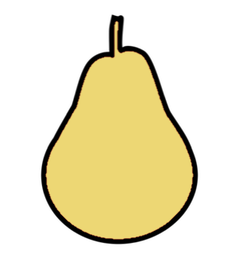

.. PEARS documentation master file, created by
   sphinx-quickstart on Wed Jul 15 09:53:36 2015.
   You can adapt this file completely to your liking, but it should at least
   contain the root `toctree` directive.

Pears
=================================

*A brief intervention to manage pain*

Pears is a brief intervention to help people manage pain after surgery. The name stands for: Pain Education And Relaxation with Suggestion. This guide is a prototype for patients undergoing joint replacement. 

The aims of this guide are to:

- Explain how pain works, and what it means
- Teach you how to reduce your pain after surgery

:ref:`Start the course now <introduction>`.

.. toctree::
   :maxdepth: 1
   :hidden:

   introduction
   how-pain-works
   the-basics

   glossary

