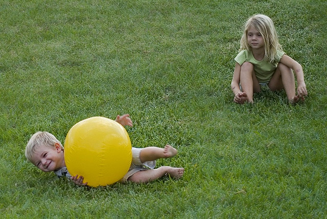
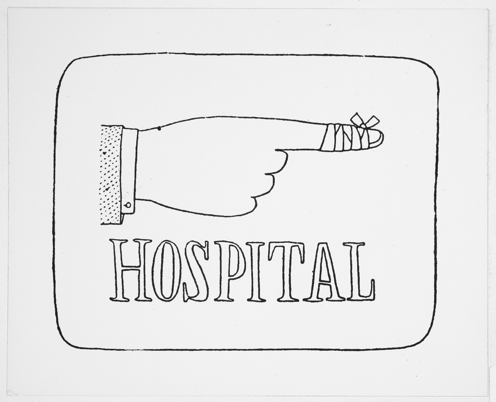

A new understanding of pain
=================================

Everyone knows what pain is like, but doctors have only recently begun to understand how pain works, and how to treat it.

This new understanding has changed the way we treat pain after surgery. Drugs are still an important part of treatment. But doctors and other experts also recommend simple techniques to change how we think and feel about pain.

.. container:: admonition
	
	Simple techniques to stay relaxed, calm, and positive after surgery are recommended by surgeons and pain experts.

-9paC8L-9Y3Wd9-9FdirU-8VQfQb-7B6Yqs-dKuyN-4UcLTB-ar3TVq-bpBwzw-9cszRw-8VDpsL-8VDp2w-e6W8DF-8eAwVu-6TyRFP-ikVsYr-ayGnaa-bkGei2-4TLEMC-d9UJCP-cBjMX3-6kTX8X

Pain seems simple
**************************

When we are children, pain seems simple. We know that cutting a finger or scraping knee is painful because the body has been damaged.  

But parents know this isn't the whole story. 

Different children react to the same injury in different ways. And a child may change from one day to the next. When happy or distracted by a game a child may not even notice an injury. But when bored, upset, or anxious the same child will find even minor scrapes painful.

How we feel really does change pain
***************************************

Over the last 20 years, scientists' understanding of pain has changed.

We now know that the link between our emotions and pain is not just 'in the head'. How we think and and feel has a big impact on our bodies, and can cause major changes to the physiology of injuries. 

This is what everyone needs to know:  

.. container:: admonition

	1. Damage to the body doesn't always cause pain
	2. Pain isn't always caused by damage to the body
	3. There are powerful ways to reduce pain by changing how we think and feel.

Why does this matter?
*******************************

Everybody gets hurt, sometimes. 

Painkilling drugs are an important part of treatment after surgery, and used properly can be very effective.  `Find out more about using painkillers properly <painkillers>`_.

But drugs aren't the only way to reduce pain, and don't always prevent people from experiencing long-lasting pain, sometimes months or years after an operation.

Other techniques, including relaxation and positive suggestions, can make painkillers more effective, and might help reduce the risk of long-lasting pain.

Relaxation and positive suggestions can also give you more control over your care, and may help you recover faster and regain better use of your joint.

.. container:: admonition

	Relaxation, reducing anxiety, and positive expectations, are recommended by NICE and pain experts as part of the standard treatment following surgery. 

Pears is designed to explain why these techniques work, and make them easy to use in hospital or at home. You can use this guide to get started now:

:doc:`➪  Find out more about how pain really works <how-pain-works>`

:doc:`➪  Learn how to reduce your pain after surgery <ways-to-change>`.

.. toctree::
   :maxdepth: 1

   how-pain-works

.. raw:: html

   
