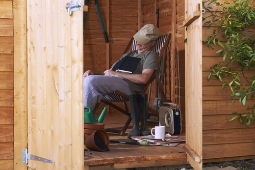

Relaxation
===================

	Everyone relaxes in different ways

Relaxation is an important part of a healthy, active lifestyle. Relaxing is not only pleasurable. Like sleeping, deep relaxation also promotes many changes in our bodies which improve health and wellbeing. 

For example: 

- Relaxation can reduce blood pressure, helping us to avoid heart attacks or strokes.
- Relaxation can also strengthens our immune system, helping us to fight disease.
- For patients having surgery relaxation reduces pain and anxiety, and may promote faster recovery.
  

Simple ways to relax
-----------------------------

Everyone has their own ways to relax. But in hospital, away from familiar surroundngs, there are some simple methods which can help everyone:

.. toctree::
	:maxdepth: 1

	relax-peaceful-place
	relax-muscle
	relax-breathing

These techniques have been used by thousands of patients around the world as part of their recovery We have made audio recordings to help you practice muscle relaxation and positive visualisation in hospital.  

.. container:: actionlink
	
	:doc:`Find out how to use the peaceful place relaxation <relax-peaceful-place>`
	
