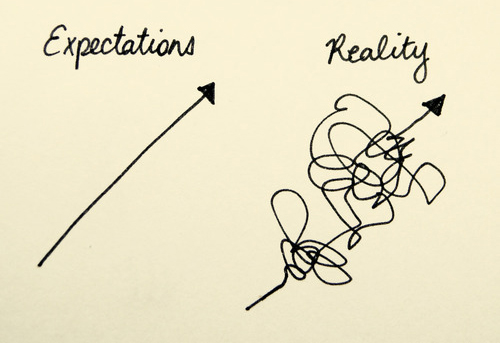

Positive suggestion
============================

What we expect to happen can have a strong influence on how we experience the world, and this is particularly true for pain.  

Pain is the simple result of signals from the body, and pain occurs when the sensations we experience are interpreted as dangerous. This is why relaxing can help reduce pain: when we relax we interpret sensations as less threatening, and less painful. 

But there are other ways to change our expectations, and our experience of pain. One commonly used technique is to bring to mind an outcome we would like, and focus our attention on this. Sometimes, it helps to listen to suggestions which describe a positive outcome. Just imagining some things doesn't make them true — if it did we would all be lottery winners! But our brains and bodies are tightly connected. 

**We are able to shape how we experience pain, the sensations we feel, and our movements, by listening and responding to positive suggestions.**

A simple example:

In the audio recording below, we ask you to listen and respond to some suggestions about how your body feels: The speaker suggests your body feels heavy and warm. Listen to the suggestions and notice how they make you feel.  Most people are able to respond to suggestions like this. If feel yourself responding, it's likely this type of suggestion can help you as you recover from surgery:

.. raw:: html
    :file: start-audio-players.script

*A short example of a positive suggestion*. 

.. raw:: html
	
	<audio src="https://plymouth-pears.s3.amazonaws.com/positive-suggestion-clip.mp3" preload="auto">
	</audio>

.. note:: 

	This audio clip will include a suggestion that the patient is feeling warm, soft and heavy — sinking down into their chair or bed. Followed by an awakening.

Other types of positive suggestions
~~~~~~~~~~~~~~~~~~~~~~~~~~~~~~~~~~~~~~~~~~~~~

Many patients find positive suggestions helpful when recovering from surgery. These suggestions might include:

- The sensation that pain is reducing
- A feeling of lightness, and agility
- A feeling of strength and balance
  
Other suggestions can be made in response to the needs of particular patients:

- The sensation that the joint feels cool, and that any swelling is reduced
- That nausea is passing
  

:doc:`➪ Choose from the full audio recordings of these positive suggestions <playlist>`

